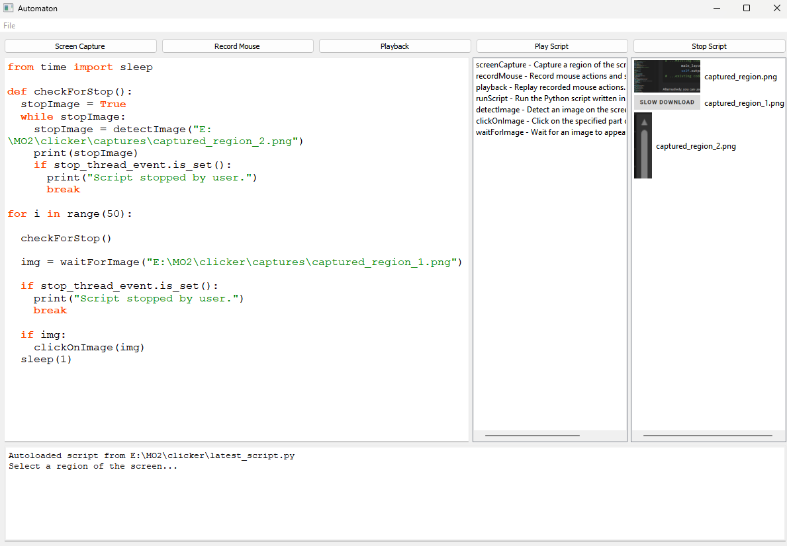

# Automaton

  
  
  
  

**Automaton** is a GUI-based tool for automating mouse and keyboard actions. It allows you to record and replay events, perform smooth mouse movements, and execute custom automation scripts directly within the application.

---

## Features

- **Mouse Event Recording**:
  - Record mouse movements, clicks, and scrolls to a file.
  - Toggle recording with a hotkey (`Ctrl + F1`).
- **Event Playback**:
  - Replay recorded mouse events from a saved file.
- **Smooth Mouse Automation**:
  - Smoothly move the mouse to specific coordinates.
  - Perform left-click, right-click, or double-click actions.
- **Script Execution**:
  - Write and execute Python automation scripts within the GUI.
- **Screen Capture**:
  - Select and save portions of the screen.

---

## Installation

### Clone the Repository
```bash
git clone https://github.com/MisterDr/automaton.git
cd automaton
pip install -r requirements.txt
```
#### MacOS
```bash
git clone https://github.com/MisterDr/automaton.git
cd automaton
brew install qt5
brew link qt5 --force
pip install -r requirements.txt
```

### Install Dependencies
1. Install the required Python packages:
   ```bash
   pip install -r requirements.txt
   ```
2. Dependencies include:
   - `pynput`: For mouse and keyboard control.
   - `PyQt5`: For GUI functionality.

#### `requirements.txt`
```
pynput
PyQt5
```

---

## Usage

### Running the Application
To start the application, run:
```bash
python automaton.py
```

### Screenshots


### Application Features
- **Top Bar**:
  - **Screen Capture**: Select and save a portion of the screen.
  - **Record Mouse**: Start and stop mouse event recording.
  - **Playback**: Replay recorded mouse events.
  - **Play Script**: Execute custom Python scripts written in the editor.
- **Script Editor**:
  - Write Python scripts with syntax highlighting and autocomplete.
- **Output Window**:
  - View script outputs and logs.
- **Thumbnails**:
  - View saved screenshots.
  - Click thumbnails to insert their file path into the script editor.

---

## Examples

### Recording Events
1. Select **Record Mouse** in the GUI or press `Ctrl + F1` to toggle recording.
2. Perform mouse actions (e.g., move, click, scroll).
3. Recorded events are saved to `mouse_events.json`.

### Replaying Events
1. Select **Playback** in the GUI to replay recorded actions.
2. You can also replay events programmatically:
   ```python
   from mouseLib import replayMouseEvents
   replayMouseEvents("events.json")
   ```

### Smooth Mouse Movement
Move the mouse smoothly to `(800, 600)` over 1 second:
```python
from mouseLib import moveMouse
moveMouse(800, 600, duration=1.0)
```

### Smooth Mouse Movement with Clicks
Move the mouse to `(500, 400)` and perform a double right-click:
```python
from mouseLib import moveMouseClick
moveMouseClick(500, 400, click_type="right", double=True, duration=0.5)
```

---

## File Structure
```
.
├── automaton.py         # Main application file with GUI
├── mouse_events.json    # Recorded mouse events (generated dynamically)
├── captures/            # Folder for saved screenshots
├── requirements.txt     # Dependencies for the project
├── LICENSE              # License information
├── screenLib.py         # Screen capture library
├── mouseLib.py          # Mouse automation library
└── README.md            # Documentation
```

---

## Contributing

Contributions are welcome! Please fork this repository and submit a pull request with your improvements or new features.

---

## License

This project is licensed under the MIT License. See the [LICENSE](LICENSE) file for details.

---

## Future Enhancements

- Add keyboard action recording and playback.
- Support drag-and-drop mouse actions.
- Introduce custom hotkeys for automation features.
- Provide a timeline editor for recorded events.
- Add support for linux and macOS.
- Add more automation features and libraries.
- Add plugin support for custom automation scripts.

---
